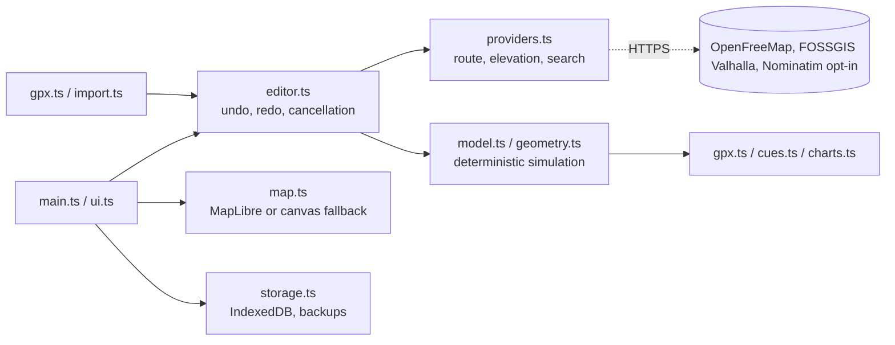

<div align="center">

# SimRun

**Local-first route editor and explicitly simulated GPX activity studio.**

[](https://simrun.vercel.app)
[](https://github.com/exterminatorrat/simrun/actions/workflows/verify.yml)


### [Open the web app → simrun.vercel.app](https://simrun.vercel.app)

[Features](#features) · [Quick start](#quick-start) · [Architecture](#architecture) · [Deploy](#deploy-to-vercel) · [Privacy](#external-services-and-privacy) · [Contributing](CONTRIBUTING.md) · [Security](SECURITY.md)

</div>

---

Draw pedestrian or bicycle routes, import GPX, KML or GeoJSON, adjust timing, preview profiles, export simulated activities, and keep a browser-local library. No login, payments, cloud database, analytics, or secrets.

| | |
| --- | --- |
| **Live app** | https://simrun.vercel.app (static Vercel deployment of `dist/`) |
| **Source** | https://github.com/exterminatorrat/simrun (`main`) |
| **Stack** | Strict TypeScript, native DOM, ES modules; no framework, zero runtime dependencies |
| **Data** | Stays in your browser: IndexedDB, localStorage, Cache Storage |
| **Hosting** | Any static host; preconfigured by `vercel.json` |

## Features

- **Routing:** cancellable, throttled Valhalla requests (never automobile costing) with **walk**, **hike**, **road** and **mountain-bike** profiles; over-long routes get a clear public-limit message (about 100 km on foot, 150 km by bike) that points at self-hosting. Waypoint editing, shaping handles, undo/redo, reverse, out-and-back, close-loop, and loop planning by lap count or target distance.
- **Simulation:** deterministic and seeded; terrain-aware pacing from a centered 30 m smoothed grade with asymmetric uphill/downhill cost; weather presets that scale duration and deepen cardiac drift; estimated power, cadence and fatigue; optional synthetic heart rate with warm-up and drift; distance-anchored rest stops with elapsed-vs-moving time; structured interval workouts; simulated GPS noise and signal dropout; custom splits and workout-step boundaries with a per-segment table.
- **Import/export:** GPX, KML and GeoJSON in; GPX (with opt-in power/cadence/temperature extensions), TCX, turn-by-turn cue-sheet CSV, SVG profiles and JSON backup out.
- **Analysis and library:** heart-rate zones, a pace/speed histogram and per-unit split charts; tags, search, sort, drag-and-drop import and a storage estimate.
- **Local-first:** IndexedDB history and drafts with an explicitly labeled **Session only** fallback; offline app shell via service worker.
- **UI:** MapLibre/OpenFreeMap basemap with a labeled coordinate-canvas fallback; metric/imperial units; light/dark appearance; mobile settings sheet.

There is **no seeded activity, artificial road network, or fake successful routing**. Browser tests use their own synthetic fixtures and mocked providers. Failed road routing never promotes a straight waypoint preview into an exportable route.

Routes can be shared as a geometry-only URL fragment with a copy fallback, a coordinate/history privacy note and a printable cue sheet; a PWA manifest enables installation. Every simulated value stays labeled as estimated, not measured.

**Not yet implemented:** FIT export/import, side-by-side activity comparison, QR-code rendering, route-corridor tile download, the opt-in offline routing cache, alternate-route requests and gradient-shaded route segments. Implementation plans for these live in `docs/plans/`.

## Quick start

Node.js 20 or newer and npm. The tested toolchain is Node 22 and TypeScript 5.8.3.

```sh
npm ci
npm test
npm run dev -- --host 0.0.0.0 --port 5173
```

| Script | Purpose |
| --- | --- |
| `npm run dev` / `npm start` | Local static server (`scripts/serve.mjs`); not a production dependency |
| `npm run build` | `tsc` then `scripts/build.mjs`, producing `dist/` |
| `npm run typecheck` | `tsc --noEmit` |
| `npm test` | Build, then `node --test tests/*.test.mjs` |
| `npm run vendor` | Refresh the pinned MapLibre bundle |
| `npm run package` | Create the source handoff archive |

For static hosting, serve **`dist/`** (entry `dist/index.html`). Relative asset paths support deployment below a URL prefix. Use HTTPS or a normal localhost origin, not `file://`.

## Deploy to Vercel

The production app is live at **https://simrun.vercel.app**. `vercel.json` pins the build (`npm ci`, `npm run build`, output `dist`). Never serve the unbuilt `public/` directory. Project linkage, deploy commands and credential handling are in [docs/DEPLOY-VERCEL.md](docs/DEPLOY-VERCEL.md).

## Architecture

Strict TypeScript, native DOM components, ES modules, and standard browser APIs. TypeScript is the only build dependency, exactly pinned in `package-lock.json`. The project does not use React/Vite: a small standards-based static app was chosen over an unverified framework dependency chain.



| Module | Responsibility |
| --- | --- |
| `src/main.ts` | Composition, forms, library, settings and workflow |
| `src/editor.ts` | Route changes, undo/redo and stale-request cancellation |
| `src/map.ts` | MapLibre integration and honest coordinate-only fallback |
| `src/providers.ts` | Routing, elevation, intentional geocoding and rate limits |
| `src/geometry.ts`, `src/model.ts` | Geodesic math, validation and deterministic simulation |
| `src/gpx.ts` | Browser-local XML parsing and GPX serialization |
| `src/import.ts` | KML and GeoJSON parsing onto the shared import pipeline |
| `src/cues.ts` | Cue-sheet CSV generation |
| `src/storage.ts` | Versioned IndexedDB, preferences and validated backups |
| `src/charts.ts`, `src/ui.ts` | Responsive SVG profiles and DOM primitives |
| `src/sw.ts` | Service worker: app-shell precache and basemap cache |

Application-specific assets are in `public/`. System fonts are used; there are no bundled font files.

## Documentation

| Document | Contents |
| --- | --- |
| [docs/DEPLOY-VERCEL.md](docs/DEPLOY-VERCEL.md) | Vercel project, commands, protection notes |
| [docs/SELF-HOST-VALHALLA.md](docs/SELF-HOST-VALHALLA.md) | Self-hosting routing to lift public limits |
| [docs/IMPLEMENTATION.md](docs/IMPLEMENTATION.md) | Implementation notes |
| [docs/VERIFICATION.md](docs/VERIFICATION.md) | What was and was not verified |
| [docs/ACCEPTANCE.md](docs/ACCEPTANCE.md) | Acceptance scenarios |
| [CONTRIBUTING.md](CONTRIBUTING.md) | Development workflow and PR checklist |
| [SECURITY.md](SECURITY.md) | Threat model and vulnerability reporting |
| [THIRD_PARTY_NOTICES.md](THIRD_PARTY_NOTICES.md) | Licenses, attribution and data terms |

## External services and privacy

OpenFreeMap supplies the Liberty basemap. The default routing/elevation endpoint is FOSSGIS's public Valhalla service, with `pedestrian` or `bicycle` costing, never automobile costing. These endpoints are replaceable in Settings. FOSSGIS's public Valhalla caps a single route at 100 km (`pedestrian`) or 150 km (`bicycle`) and rejects longer requests with its own error; self-host Valhalla and raise `service_limits` to route farther, as described in [docs/SELF-HOST-VALHALLA.md](docs/SELF-HOST-VALHALLA.md). Map views, waypoint coordinates and requested elevation samples go to the providers. GPX file contents are not uploaded; converting an imported route to routed waypoints sends those chosen coordinates after confirmation.

**MapLibre GL JS 5.6.1 is served locally.** The checked-in `public/vendor/` includes its CSP build, dedicated same-origin worker, CSS and upstream license. Runtime rendering no longer requests unpkg. To refresh the pinned bundle from upstream:

```sh
npm run vendor
npm run build
```

The OpenFreeMap Liberty style, and the OpenFreeMap dark style that is selected automatically in dark appearance, keep their vector tiles, sprites and glyphs external. Both style URLs are replaceable in Settings. If WebGL or all basemap resources fail, the app shows a labeled coordinate canvas and keeps route editing usable. A single failed tile or glyph does not immediately disable the map.

Cue-sheet export writes a CSV with start, turn and finish rows. Turns are read from the exported route geometry rather than from street names, so routed, imported and loop-planned routes all produce one.

Nominatim place search is **off by default**. Enable it deliberately only after reading the policy linked in Settings: https://operations.osmfoundation.org/policies/nominatim/. No autocomplete; searches are user-submitted, cached and limited to a small result set. Service requests are queued at least 1.2 seconds apart, with cross-tab coordination where browser APIs permit. Public providers offer no availability guarantee. Before a public release, review current provider terms, notify the Valhalla demo operators as requested in their guidance, and configure a suitable identifying client header if required. Do not deploy this personal-use configuration as a high-volume public service.

## Persistence and backups

IndexedDB database `simrun-local`, schema version 1: `activities` and `meta` (current draft). Small preferences and search/rate-limit caches use localStorage. Each saved activity stores versioned settings, seed and geometry, not duplicated full simulation output. On unsupported/blocked storage, the interface explicitly says **Session only**. Clearing site data or moving to a different origin does not migrate your library. Use History → Back up local data / Restore backup. Do not expect a new Sites preview URL to inherit the old origin's data.

**Offline map data.** A service worker precaches the built application shell from `dist/sw-manifest.json`, so the app opens without a network after one visit. Basemap resources from the OpenFreeMap endpoint are cached as you view them and served cache-first, bounded to 1,500 entries; routing, elevation and search are never cached. Cache Storage is a third store beside IndexedDB and localStorage, and clearing site data removes it too. Settings → Offline map data reports how many resources are cached and clears them. Only the areas you have actually viewed are available offline.

## Verification and real limitations

See [docs/VERIFICATION.md](docs/VERIFICATION.md) and [docs/ACCEPTANCE.md](docs/ACCEPTANCE.md). The creation environment had no Sites tool, no package-network access and a browser that blocked HTTP/file navigation. The source builds and logic tests run locally; UI tests ran in an isolated DOM harness with mocked providers. **A private Sites preview, live road routing, actual MapLibre rendering, hosted CORS/CSP and native IndexedDB reload persistence are not verified here.**

GPX, KML and GeoJSON imports retain the largest continuous segment when a file contains disjoint segments and tell the user; they do not invent connecting paths. GeoJSON and KML geometry without timestamps falls back to the activity timing settings. Exports are resimulations, not lossless copies of original recordings. Start time uses an explicit fixed UTC offset; check that offset for the chosen date, including daylight-saving changes. Very long simulations increase the effective sample interval to cap output at approximately 50,000 points. Optional custom splits and GPS noise/dropout are simulated deterministically from the saved seed: noise jitters exported coordinates while distance and timing stay on the true route, and dropout removes fixes in outages, which export as separate track segments instead of invented straight lines. These remain synthetic effects, not device measurements.

## Browser checks

The optional test runner is separate from application runtime dependencies:

```sh
python -m pip install -r tests/requirements.txt
python -m playwright install chromium
# In another terminal, leave npm run dev running:
python tests/browser.py --url http://127.0.0.1:5173
```

This uses mocked providers and intentionally unavailable CDN to exercise the coordinate fallback; it never hits public routing services. On a normal HTTP origin it also checks native IndexedDB restoration. `--isolated` compiles an AMD test harness into a temporary directory and runs without navigation; it explicitly does not test HTTP/ESM, MapLibre or persistent storage. `--screenshots <directory>` is optional; keep screenshots outside the source archive.

## Package

```sh
npm ci
npm test
npm run package
```

Creates `simrun-sites-handoff.zip` with one `simrun/` root. The packager excludes dependencies, builds, caches, secrets and test outputs; includes a source hash manifest; and resolves Git metadata when available. It refuses a dirty Git checkout. For a connector-verified source copy without `.git`, use `node scripts/package.mjs --commit <verified-source-sha>`. `BUILD_INFO.json` is generated snapshot metadata: its Git SHA names the source commit, avoiding an impossible self-referential commit hash. `SOURCE_DATE_EPOCH` can fix archive creation time for repeatability.


## License

[MIT](LICENSE). The license does not cover the brand images in `public/` (`logo.jpg`, `mark.jpg`, `favicon.png`, `apple-touch-icon.png`): they are third-party artwork the project owner has no rights to, and they are not licensed for reuse. Third-party components and their licenses are listed in [THIRD_PARTY_NOTICES.md](THIRD_PARTY_NOTICES.md).
